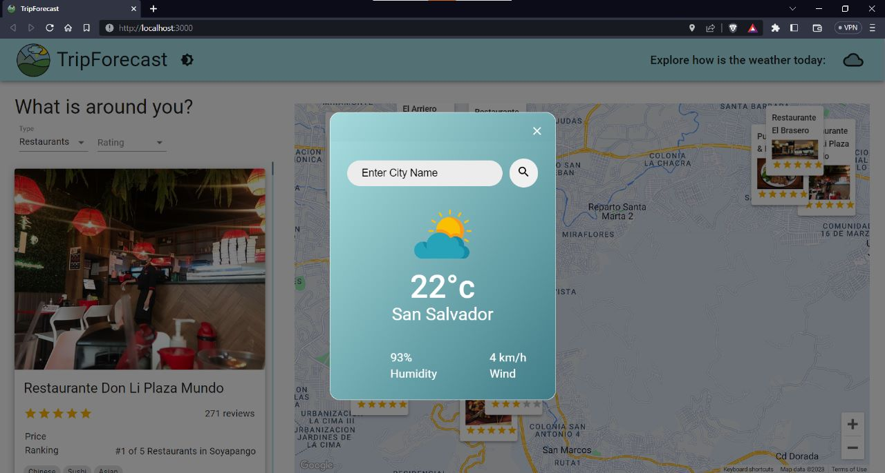

# Asesor de Viajes

## Introducción

La aplicación TripForecast está orientada a brindar recomendaciones de viaje y actuar como un enlace entre el cliente y las distintas compañías,locales o empresas que brindan algún tipo de servicio. Las personas cuando viajan o visitan otro país desean conocer lugares nuevos y degustar de la gastronomía del país donde se encuentran, es así como un Travel Advisor les beneficia, siendo su mejor opción. Ellos podrán localizar, contactar, reservar, obtener información, ver recomendaciones, comparar y sobre todo encontrar el mejor precio entre todos los lugares alrededor de ellos. De igual forma se encuentra la opción de revisar el estado del clima en tiempo real de cualquier ciudad, esto ayudando a los viajeros en consultar las condiciones del clima para estar preparados en su viaje. Algunas de las funcionalidades importantes a destacar del proyecto son: la geolocalización, integración de Google Maps, búsqueda de lugares, obtención de restaurantes, hoteles y atracciones según la ubicación, consulta del clima para cualquier ciudad que se desea visitar. El área es tanto Social como de Sistemas de Información Geográfica, donde la idea principal es agregar funcionalidades que vengan a favorecer ambas temáticas y corregir ciertos problemas o errores que el proyecto existente contenga. En resumen, la aplicación Travel Advisor es una herramienta integral para los viajeros que buscan la mejor experiencia en sus viajes.

APIs Utilizadas:

[RapidAPI](https://rapidapi.com/hub)
[API de Asesor de Viajes](https://rapidapi.com/apidojo/api/travel-advisor/)
[API de Open Weather Map](https://openweathermap.org/)

## Indicaciones de Ejecución

Configuración: ejecuta `npm i && npm start` para iniciar el servidor de desarrollo asegurate de utilizar la versión 9.7.1 de npm y la versión 16.6.0 de node.

## Funcionalidades añadidas

1. Descripción de la Feature: Weather API Check:

- Detalles para añadir Feature:

  - Eliminar todo lo relacionado a la API Weather utilizada anteriormente, debido a que esta deprecado
    y no se pudo ocupar otro que se asimilara al que utilizaba.
  - Buscar una API con respecto al Clima que fuera de forma gratuita y completa en cuanto al uso de la misma.
  - Crear la Card o el Contenedor donde se mostraria la información del Clima y la solicitud de la Ciudad o Lugar
    que se desea conocer el clima.
  - Darle el mejor diseño adaptándose al proyecto ya utilizado.
  - Hacer las pruebas pertinentes del código y funcionamiento de la Feature.
  - Agregar el Error que "no se encuentra la ciudad solicitada", esto es debido a que no
    se le ha proporcionado una indicación certera del lugar.

- Pasos para reproducir la Feature:
  - Clonar el repositorio desde el enlace proporcionado
  - Ejecutar el comando npm i && npm start con la versión 16.6.0 de node
  - En el header de la aplicación, se ha colocado una indicación para poder verificar el clima
    , es ahi donde se procede a presionar el botón con forma de nube.
  - Tras realizar el paso anterior, aparecerá un modal donde debemos digitar la ciudad que deseamos saber el clima, luego presionar buscar
    y listo, ya nos aparecerá la información solicitada.

2.  Descripción de la Feature: Improve Designs

- Detalles para añadir Feature:

  - Agregar en el Header un Toggle Button para controlar el Modo Nocturno o Claro de la Aplicación.
  - Añadir el control de los colores y funcionalidad del botón, con ayuda de CreateTheme de Material UI
    para poder agregar los colores primarios y secundarios de ambos estilos.
  - Agregar Footer de la Aplicación.
  - Craer y añadir un Logo asociado al Trip and Weather Advisor.

- Pasos para reproducir la Feature:
  - Clonar el repositorio desde el enlace proporcionado
  - Ejecutar el comando npm i && npm start con la versión 16.6.0 de node
  - En el header de la aplicación se ha colocado un botón en forma de sol, donde solo se necesita presionarlo para cambiar
    el tema de la aplicación.

## Primer Avance
A continuación esta el documento actualizado del primer avance del proyecto: [Primer Avance Proyecto](https://docs.google.com/document/d/1b0Ge7YcObo1NSOVsYbo-NO9hCcN8ujctWtFGhJB7GfE/edit?usp=sharing) 
